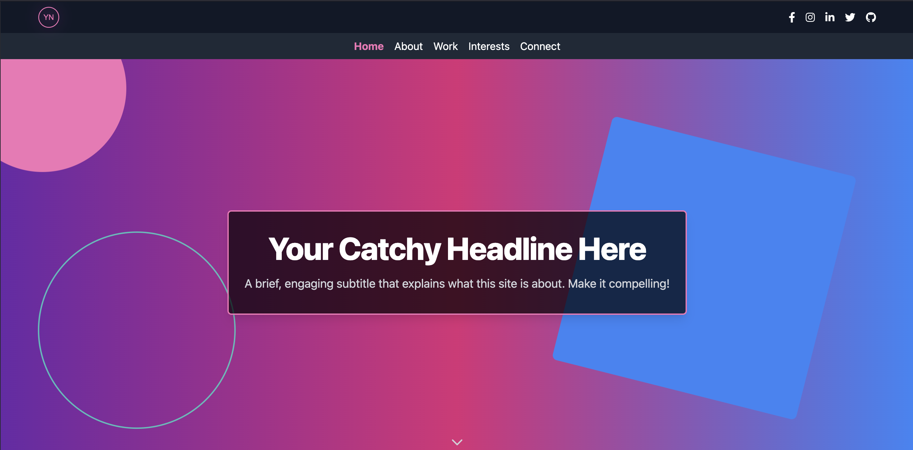

# Vibe-Coded Retrowave Portfolio Template

[](https://opensource.org/licenses/MIT)
[](https://deepmind.google/technologies/gemini/)
[](https://www.anthropic.com/claude)
[](https://cursor.sh)

## 🌐 [Live Demo](https://eleventy-personal-site.pages.dev/) <!-- Update this link if you have a demo -->

A vibe-coded, retro-inspired multi-page portfolio and personal website powered by Eleventy and Tailwind CSS. Features modular components, interactive sections, and easy customization through JSON data files. Part of my collection of pure vibe-coded projects.



---

## What is Vibe-Coding?
This project follows the vibe-coding philosophy—where code is an extension of personal style and intuition. Every design and component is crafted based on vibes, resulting in a site that feels uniquely yours.

### Development Approach
- **Primary Development:** Gemini 2.5 Pro
- **Quality Assurance & Debugging:** Claude 3.5 Sonnet
- **Development Environment:** Cursor IDE for seamless AI integration

---

## Tech Stack
- **Static Site Generator:** Eleventy (for the ultimate vibe)
- **Templating:** Nunjucks
- **Styling:** Tailwind CSS (utility-first, retro vibes)
- **Content:** Markdown + JSON data files

### Why JSON Data Files?
Using JSON (`.json`) for data management keeps things simple, structured, and easy to update. All site-wide info, author details, and social/contact links live in `src/_data/site.json`—edit once, update everywhere. This aligns with the vibe-coding philosophy: maximum flexibility, minimal fuss.

---

## Prerequisites
* [Node.js](https://nodejs.org/) (16.x or higher recommended)
* [npm](https://www.npmjs.com/) (comes with Node.js)

---

## Getting Started

1. **Clone the repository:**
    ```bash
    git clone https://github.com/KaramelBytes/eleventy-retrowave-portfolio.git
    cd eleventy-retrowave-portfolio
    ```

2. **Install dependencies:**
    ```bash
    npm install
    ```

3. **Build the site:**
    ```bash
    npm run build
    ```
    (Compiles the site into the `_site` directory)

4. **Serve the site locally (for development):**
    ```bash
    npm start
    ```
    Visit `http://localhost:8080` (or the port in your console).

---

## Why This Project?
This project demonstrates a modern, maintainable approach to building personal sites. Technical decisions were guided by:
- **Eleventy:** Fast, flexible, and perfect for static sites with a vibe
- **Data-Driven Architecture:** All content managed through JSON data files
- **Component-Based Structure:** Modular design for easy maintenance and customization
- **Retrowave Aesthetic:** Neon gradients, bold typography, and 80s-inspired UI

---

## Deployment

### GitHub Pages
1. Enable GitHub Pages in your repository settings
2. Set the build directory to `_site`
3. Your site will be live at `https://[username].github.io/[repo-name]`

### Netlify
1. Connect your repository to Netlify
2. Set build command to `npm run build`
3. Set publish directory to `_site`

### Vercel
1. Import your repository to Vercel
2. Build command: `npm run build`
3. Output directory: `_site`

---

## Purpose
This repo is a template for quickly deploying a personal, vibe-coded portfolio. It’s for individual use and public display, not for community contributions. The goal: a clean, data-driven site that’s easy to maintain and update.

---

## Key Features

* **Static Site Generation:** Powered by Eleventy for speed and simplicity
* **Retrowave Aesthetic:** Gradients, animations, and neon accents
* **Multi-Page Structure:** Home, About, Work/Portfolio, Interests, Connect
* **Data-Driven Content:** All content managed via `src/_data/site.json` and markdown files
* **Modular Templates:**
    - **Partials:** Header, footer, navigation, hero section in `src/_includes/partials/`
    - **Layouts:** Page layouts in `src/_includes/layouts/`
* **Markdown Support:** Write rich content in markdown for each page
* **SEO & Social:** Open Graph tags, Schema.org Person JSON-LD, and meta tags for sharing
* **Contact Obfuscation:** Optional Base64 encoding for emails/phones (decoded client-side)
* **Interactive Interests Page:** Clickable categories reveal sub-interests with images
* **Responsive Design:** Looks vibey on all devices

---

## Project Structure
```
src/
├── _data/          # JSON data files for site-wide info
├── _includes/      # Templates
│   ├── layouts/    # Page layouts
│   ├── partials/   # Header, footer, hero, navigation
├── assets/         # Static assets (images, CSS, etc.)
├── content/        # Markdown content for each page
└── index.md        # Home page entry point
```

---

## Customization

1. **Content:** Edit JSON in `src/_data/site.json` for site-wide info, social links, etc. Edit markdown files in `src/content/` for each page.
2. **Images:** Replace images in `src/assets/images/` (e.g., profile, backgrounds, og-image).
3. **Structure:** Adjust layouts in `src/_includes/layouts/` and partials in `src/_includes/partials/`.
4. **Styling:** Tweak Tailwind config in `tailwind.config.js` or add custom CSS in `src/assets/css/`.
5. **Metadata:** Update page titles/descriptions in markdown front matter and `site.json`.
6. **Author:** Update your name in `package.json` and LICENSE if needed.

---

## Contributions
This is a personal, vibe-coded project. Fork it, remix it, and make it your own!